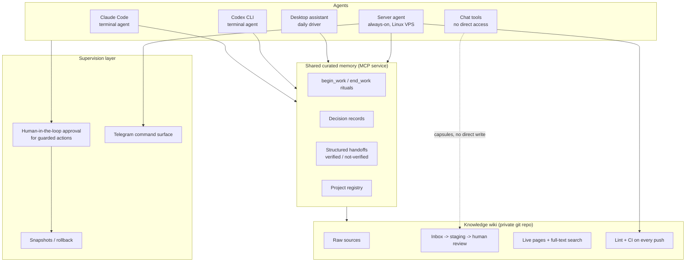

# How I Run a Supervised Multi-Agent AI Operation as a Non-Engineer

*By Artem Trofymenko - operator-builder. I ship SaaS products ([ReadyCSV](https://www.readycsv.com), [SkuSum](https://skusum.com), [LeakRelay](https://leakrelay.com)) with AI-assisted development, and I run the agent infrastructure described below every day. This is a practitioner's write-up, not a framework announcement: what I built, why, and what actually matters.*

---

## The problem: three ways agents fail you

I work with several AI agents daily - coding agents in the terminal, a desktop assistant, an always-on server agent, and chat tools. Used naively, they fail in three predictable ways:

1. **Amnesia.** Every session starts from zero. Decisions made on Monday get re-litigated on Wednesday. Context lives in scattered chat logs nobody will ever read again.
2. **Sprawl.** Each tool accumulates its own private notes, its own half-truths about project state. Two agents confidently give you two different answers about what was decided.
3. **Unsupervised actions.** An agent with terminal access is one confident hallucination away from deleting the wrong directory or pushing the wrong thing. "Just trust it" is not an operating model.

I'm not a classical software engineer. I couldn't solve this with a custom orchestration codebase - and it turns out I didn't need to. What I needed was **an operating discipline encoded in a few small, boring systems**.

## The architecture

Four layers, each solving one failure mode.

### Layer 1: Shared curated memory - the anti-amnesia layer

A small memory service (exposed to every agent via [MCP](https://modelcontextprotocol.io)) that all agents read and write through the **same contract**:

- **`begin_work`** - before touching a project, an agent pulls the current project brief: last known state, open decisions, next actions.
- **`end_work`** - after meaningful work, the agent writes a structured handoff. The format is the load-bearing part: a summary, then explicit **Verified** and **Not verified** sections, next actions, touched files, and rollback notes.
- **Decision records** - architecture, scope, and safety decisions are stored separately with their rationale, so they stop being re-argued.
- **A project registry** - one canonical slug per project. No agent gets to invent its own naming.

Two rules make this work. First: **curated, not raw**. No transcripts, no chat dumps - an agent writes the distilled outcome or nothing. Memory full of noise is worse than no memory. Second: **no secrets, ever**. No tokens, keys, private URLs, or config dumps in memory. The memory layer assumes it could leak, and is boring enough that it wouldn't matter much.

The "Verified / Not verified" split deserves emphasis. It forces every agent to separate *what it actually confirmed* (tests ran, output checked, commit pushed) from *what it merely believes*. Downstream agents - and I - treat the two sections completely differently. This single formatting rule has prevented more compounding errors than anything else in the system.

### Layer 2: A knowledge wiki - the anti-sprawl layer

Long-lived knowledge (project pages, concepts, comparisons, runbooks) lives in a **private git-backed Markdown wiki** - plain files, versioned, searchable via SQLite full-text search with BM25 ranking. Around 50 source documents and ~25 curated live pages at the time of writing. No vector database, no embeddings: at this corpus size, boring lexical search plus good page structure wins on maintainability.

The pipeline is deliberately bureaucratic:

- New material lands in an **inbox** (a small CLI accepts text notes from terminal or Telegram; it refuses anything that looks like a secret).
- A staging script validates frontmatter, scans for secret-like patterns, and writes a **review note** - it never touches live pages.
- **I approve** what graduates from inbox to raw sources to live pages. Agents propose; a human promotes.
- Every push runs **lint + CI** (schema checks, registry consistency, tests). The wiki is code, so it gets code discipline.

Chat tools that can't run tools directly still participate through a **capsule contract**: they produce a structured update document in an agreed format, which gets validated and staged like any other inbox item. No tool is trusted to write directly just because it's smart.

### Layer 3: Supervision - the anti-YOLO layer

- **Guarded actions**: terminal commands that change state go through human-in-the-loop approval. The agent explains what and why; I approve on the desktop or via Telegram.
- **Snapshot / rollback discipline**: before risky operations, take a snapshot; every handoff includes rollback notes. Undo is designed in, not improvised.
- **An always-on server agent** runs the scheduled boring work: every two hours it pulls the wiki, rebuilds the index, runs lint and staging, and writes machine-readable health artifacts. Healthy runs stay silent; only failures or items needing review get my attention. Alert fatigue is a design failure, so the default is quiet.

### Layer 4: Many agents, one contract

The point of layers 1-3 is that **agents become interchangeable workers on shared state**. A coding agent (Claude Code or Codex) does a work session and writes a handoff; the desktop assistant picks it up the next morning with full context; the server agent verifies the repo state on its next tick. Each agent plays to its strength - one gets the token-heavy generation work, another gets network-dependent verification, the always-on one gets the cron jobs - but they all speak the same memory protocol and respect the same review gates.

## Principles that turned out to matter

1. **Verify-first beats capability.** The strongest model still confidently reports unverified success. The Verified/Not-verified contract is worth more than a model upgrade.
2. **Curation is the product.** Raw logs rot. A three-sentence decision record with a rationale outlives a hundred transcripts.
3. **Staged writes everywhere.** Agents propose, validation gates check, humans promote. This applies to wiki pages, memory, and outbound anything.
4. **Boring technology wins.** Markdown, git, SQLite, cron. Every component is inspectable by a human - which is the entire point when the writers are AIs.
5. **The human is a role, not a bottleneck.** My approval sits exactly where irreversibility lives: promotions to live pages, state-changing commands, anything leaving the system. Everything reversible is delegated.

## What it enables in practice

Two concrete examples, both running today.

My job-search operation: one agent scans job boards through ATS APIs (a single pass covers 85 companies and roughly 5,900 postings) and filters them against my constraints down to a few hundred relevant offers. Full job descriptions are captured through the ATS APIs, not scraped screenshots, so every evaluation is based on the real text. Evaluations are written as reviewable reports with explicit scores and disqualification reasons ("requires fluent French", "hybrid 3 days a week in London"). Tailored CVs and cover letters are generated as application packs - and a hard guardrail means **nothing is ever submitted by an agent**. Every pack ends at a human review step, with the reasoning documented. Two applications went out in the first week, both to roles scoring at the top of the ranked pipeline.

My product work runs on the same pattern. ReadyCSV ships behind a QA gate of 99 unit tests and 45 Playwright end-to-end tests in CI; agents propose fixes, the gate checks them, I review before release. SkuSum runs a design-partner feedback loop where a partner's spec, test fixtures, a routing bug fix, and a new export policy all shipped the same day - agents did the volume, the test suite (23 app-logic tests across 7 suites) kept the truth straight, and I approved each release. Agents do the volume, contracts keep the truth straight, I make the calls.

## Lessons for operators starting today

- Start with the **handoff format**, not with tooling. Even a single markdown file of structured handoffs beats a smarter agent with no memory.
- Add the **no-secrets rule on day one**. Retrofitting it is miserable.
- Give every project **one canonical name** and keep a registry. Naming drift is how shared memory quietly dies.
- Put your approval **only where things are irreversible**. If you approve everything, you'll start rubber-stamping - which is worse than approving nothing.
- Prefer systems you can read. If you can't open the store in a text editor and understand it, you won't audit it, and unaudited agent memory becomes fiction.

---

*I'm happy to walk anyone through the setup in more detail - the specifics are private, but the patterns are portable. Reach me on [LinkedIn](https://linkedin.com/in/trofymenko-artem) or see what else I build at [github.com/artemtrofymenko](https://github.com/artemtrofymenko).*
