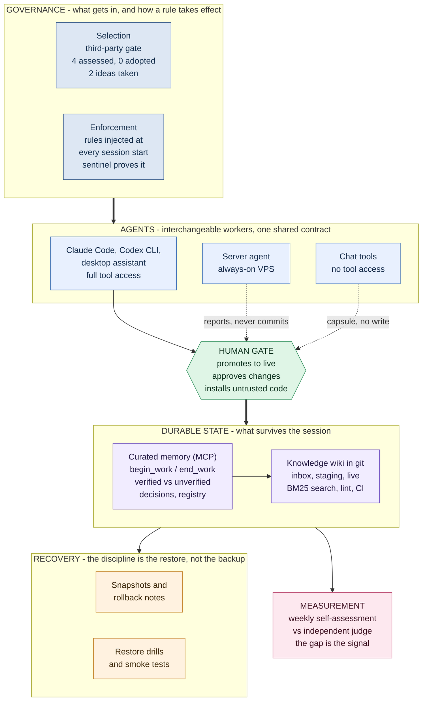

# How I Run a Supervised Multi-Agent AI Operation as a Non-Engineer

*By Artem Trofymenko - operator-builder. I ship SaaS products ([ReadyCSV](https://www.readycsv.com), [SkuSum](https://skusum.com), [LeakRelay](https://leakrelay.com)) with AI-assisted development, and I run the agent infrastructure described below every day. This is a practitioner's write-up, not a framework announcement: what I built, why, and what actually matters.*

*Last revised August 2026. Numbers in this document are measured, not estimated, and dated where they move.*

---

## The problem: three ways agents fail you

I work with several AI agents daily - coding agents in the terminal, a desktop assistant, an always-on server agent, and chat tools. Used naively, they fail in three predictable ways:

1. **Amnesia.** Every session starts from zero. Decisions made on Monday get re-litigated on Wednesday. Context lives in scattered chat logs nobody will ever read again.
2. **Sprawl.** Each tool accumulates its own private notes, its own half-truths about project state. Two agents confidently give you two different answers about what was decided.
3. **Unsupervised actions.** An agent with terminal access is one confident hallucination away from deleting the wrong directory or pushing the wrong thing. "Just trust it" is not an operating model.

I'm not a classical software engineer. I couldn't solve this with a custom orchestration codebase - and it turns out I didn't need to. What I needed was **an operating discipline encoded in a few small, boring systems**.

Since the first version of this write-up, three more failure modes showed up that I had not anticipated. They are covered in layers 5, 6 and 7, and honestly they are the more interesting half.

## The architecture

### Layer 1: Shared curated memory - the anti-amnesia layer

A small memory service (exposed to every agent via [MCP](https://modelcontextprotocol.io)) that all agents read and write through the **same contract**:

- **`begin_work`** - before touching a project, an agent pulls the current project brief: last known state, open decisions, next actions.
- **`end_work`** - after meaningful work, the agent writes a structured handoff. The format is the load-bearing part: a summary, then explicit **Verified** and **Not verified** sections, next actions, touched files, and rollback notes.
- **Decision records** - architecture, scope, and safety decisions are stored separately with their rationale, so they stop being re-argued.
- **A project registry** - one canonical slug per project. No agent gets to invent its own naming.

Two rules make this work. First: **curated, not raw**. No transcripts, no chat dumps - an agent writes the distilled outcome or nothing. Memory full of noise is worse than no memory. Second: **no secrets, ever**. No tokens, keys, private URLs, or config dumps in memory. The memory layer assumes it could leak, and is boring enough that it wouldn't matter much.

The "Verified / Not verified" split deserves emphasis. It forces every agent to separate *what it actually confirmed* (tests ran, output checked, commit pushed) from *what it merely believes*. Downstream agents - and I - treat the two sections completely differently. This single formatting rule has prevented more compounding errors than anything else in the system.

**Subtraction is a feature.** The memory service originally ran an automatic insight-derivation pass and a summarisation model on top of the stored records. I benchmarked what they actually contributed and turned both off. Vector sync and embeddings stayed, verified across all 509 records at the time. The store is now smaller, faster, and easier to audit. A component you can measure and then remove is worth more than one you keep because it sounded advanced.

### Layer 2: A knowledge wiki - the anti-sprawl layer

Long-lived knowledge (project pages, concepts, comparisons, runbooks) lives in a **private git-backed Markdown wiki** - plain files, versioned, searchable via SQLite full-text search with BM25 ranking. Roughly 30 curated live pages over 14 raw sources, about 60 indexed documents in total as of late July 2026. No vector database, no embeddings; the measurement behind that choice is in layer 7.

The pipeline is deliberately bureaucratic:

- New material lands in an **inbox** (a small CLI accepts text notes from terminal or chat; it refuses anything that looks like a secret).
- A staging script validates frontmatter, scans for secret-like patterns, and writes a **review note** - it never touches live pages.
- **I approve** what graduates from inbox to raw sources to live pages. Agents propose; a human promotes.
- Every push runs **lint + CI** (schema checks, registry consistency, tests). The wiki is code, so it gets code discipline.

Four constraints that turned out to matter more than any feature:

- **Text only, no binaries.** No images, audio, video, PDFs, office files or archives are ever committed. Media becomes an annotation instead: a summary, timestamps, extracted text, safe references, metadata. The raw file stays outside. A repository that AI agents write into stays auditable only while a human can still read the whole diff.
- **Every page carries a summary in my own working language.** Source material keeps its original language, but each processed source and each live page must include a Ukrainian summary. My corpus is bilingual, and this is a translation-loss control: if the summary cannot be written, the page was not understood.
- **Bounded context packs.** Agents that cannot run tools (chat clients, capsule-only assistants) get a generated context pack with a hard byte budget, on the order of 20 KB. They participate through a document, not through access.
- **Retrieval is private by default, not just storage.** Inbox, staging, anything flagged sensitive, and raw document bodies are excluded from search results unless an explicit flag asks for them. A privacy label that only guards the disk is decorative.

Chat tools that can't run tools directly still participate through a **capsule contract**: they produce a structured update document in an agreed format, which gets validated and staged like any other inbox item. No tool is trusted to write directly just because it's smart.

### Layer 3: Supervision - the anti-YOLO layer

- **Guarded actions**: terminal commands that change state go through human-in-the-loop approval. The agent explains what and why; I approve on the desktop or over chat.
- **The always-on agent is deliberately not a writer.** It pulls, rebuilds the index, runs lint and staging, and writes a report. It never commits, never pushes, and never promotes a page to live. This is the difference between claiming "agents propose, humans promote" and building a component that structurally cannot do otherwise.
- **A human installs untrusted third-party code, not an agent.** Every pilot of an external tool runs in a rootless container with only the data it needs mounted and no credentials present, and I personally execute the install step.
- **Snapshot, rollback, and restore drills.** Before risky operations, take a snapshot; every handoff includes rollback notes. Backups are not the discipline - restores are. The memory core has scripted restore drills and failure smoke tests that run on a schedule and produce a report. Anyone can claim they take backups. Almost nobody has ever restored one.
- **Quiet by default.** Healthy runs stay silent; only failures or items needing review get my attention. Alert fatigue is a design failure.

### Layer 4: Many agents, one contract

The point of layers 1-3 is that **agents become interchangeable workers on shared state**. A coding agent does a work session and writes a handoff; the desktop assistant picks it up the next morning with full context; the server agent verifies repo state on its next tick. Each agent plays to its strength, but they all speak the same memory protocol and respect the same review gates.

**Agents also accumulate skills, and those are versioned.** Each agent has its own branch in a private skills repository: one branch per agent, holding that agent's procedural knowledge as plain Markdown. When an agent learns something durable, the harvest is a commit. The git log is the learning history: diffable, revertable, and independent of whichever model is behind the agent this month. Usage is measured too, so a skill that nobody triggers can be found and deleted rather than accumulating as sediment. The most-used one in my tree has been invoked 58 times across 21 revisions.

### Layer 5: Measurement - because a system that grades itself will flatter itself

Every week the operation writes an assessment of its own output, and a separate judge scores the same period independently. What I actually track is not the score. It is **the divergence between the two**.

That number has been informative in both directions. The self-assessment ran optimistic at first, was corrected, and then over-corrected into deflation: 10.0, then 8.0, then 8.3, against a judge holding at 10.0. The prompt was recalibrated against self-deflation specifically, with a target divergence under 1.0.

An agent operation without an external scorer is a closed loop reporting on itself. The judge is cheap and the divergence is the only honest signal in the whole system.

### Layer 6: Enforcement - written is not the same as in effect

This is the failure mode I did not see coming, and it has now cost me more time than all three original ones.

A rule written into an instruction file is not a rule in force. A configuration value that a script reports as saved is not necessarily what the consumer reads. The gap between those two things has bitten me repeatedly and always in the same shape.

The clearest case: an edit script printed success, and I believed it. The consumer, a scheduler configuration on the server, disagreed. Backticks inside a here-document had been command-substituted by the remote shell, splicing a helper's console output into the field where its path was supposed to go. It was the fourth occurrence of that same class. My verification back then had read the script's own success message instead of reading the file back from where the consumer reads it.

Two mechanisms came out of that:

- **A stop-and-audit trigger.** When the same approach fails twice, or when I get visibly frustrated, the agent must stop instead of trying a third variation. It writes out what it currently believes, marks each item as confirmed by evidence or as assumption, and checks the cheapest assumption first, with the "written is not in effect" class checked before anything else. The probe must read the value back from where the consumer reads it, never from where it was written.
- **Rules injected at the front of every session.** Instead of hoping a long instruction file gets read, a session-start hook injects the small set of operating rules directly into each new session. A sentinel log records every firing, so the mechanism is provable independently of whether anything is visible on screen. The proof I insisted on was end to end: a fresh session was asked to recite the rules, and it did.

The general lesson: for every rule you care about, name the mechanism that makes it take effect, and then verify the mechanism from the consumer side. Reinforcement without enforcement decays.

### Layer 7: Selection - what I evaluated and did not adopt

Four third-party frameworks have been assessed for this operation. **Zero were installed. Two contributed ideas.** The discipline that produced that ratio is worth more than any of the tools would have been.

**GBrain** - a mature knowledge and retrieval engine. Piloted properly: a rootless container, only a copy of the wiki mounted, no credentials anywhere near it. It imported 21 pages in about a second and scored 4 of 6 on real queries with embeddings disabled, including Ukrainian morphology it handled better than mine did. My own search scored **1 of 6**, with five complete misses.

That result was the opposite of a reason to adopt it. It was a diagnosis. My search was using all-terms-must-match semantics with no morphology handling, which is why multiword and Ukrainian queries returned nothing. Changing the query semantics took my own search from 1 of 6 to 5 of 6. Then I benchmarked the fancy option anyway: pure vector search over a local embedding model scored **3 of 6**, worse than the repaired keyword search, because the corpus is small, keyword-dense, technical and bilingual, which is exactly where lexical search wins.

GBrain was parked with a numeric revisit trigger of roughly 200 pages, and that trigger is reviewed monthly against the real page count rather than left to drift. At the first review the tool had shipped features addressing three of my original objections, and I still did not un-park it, because the decision was driven by measured accuracy at my scale, not by those objections. **The pilot's real gift was exposing my own weakness, and I banked that instead of the dependency.**

**BMAD-METHOD** - a large, well-regarded planning method, MIT licensed, tens of thousands of stars, with a dozen role agents and dozens of workflows. Not installed: it targets greenfield product pipelines while my products are already live, its agent and workflow count would flood my skill registry and corrupt the usage statistics my weekly audit depends on, and its installer writes into agent configuration on a machine that holds credentials. **Its scale-adaptive idea was adopted in full**: classify work before starting, and match ceremony to size. Mechanical work is built directly, a single feature gets a comparison of real alternatives first, and anything multi-session or cross-machine has its goal, done-criteria, out-of-scope and rollback path agreed before any implementation choice is made. That took five lines and no dependency.

**Superpowers** - a capable skills plugin. Not enabled: 8 of its 14 skills duplicated ones I already had and measured, and enabling it would have polluted the usage statistics that tell me which of my own skills earn their place. **Its enforcement mechanism was adopted**, and that is the session-start hook described in layer 6. I copied the mechanism, wrote my own content, and took none of its code.

**Zaebal** - assessed and parked on the same reasoning.

The rule that came out of these four: **assess a third-party idea separately from its code.** The idea is usually free and portable. The code brings a dependency, an update treadmill, and a surface you did not design. Most of the value in all four cases was an idea I could restate in a paragraph.

## Principles that turned out to matter

1. **Verify-first beats capability.** The strongest model still confidently reports unverified success. The Verified / Not-verified contract is worth more than a model upgrade.
2. **Curation is the product.** Raw logs rot. A three-sentence decision record with a rationale outlives a hundred transcripts.
3. **Staged writes everywhere.** Agents propose, validation gates check, humans promote. This applies to wiki pages, memory, and outbound anything.
4. **Boring technology wins.** Markdown, git, SQLite, cron. Every component is inspectable by a human - which is the entire point when the writers are AIs.
5. **The human is a role, not a bottleneck.** My approval sits exactly where irreversibility lives. Everything reversible is delegated.
6. **Written is not in effect.** Name the mechanism that enforces each rule, and verify it from the side that consumes it.
7. **Measure the divergence, not the score.** A system grading itself needs an independent second opinion, and the gap between them is the signal.
8. **Assess ideas separately from code.** Four evaluations, zero dependencies, two adopted ideas.
9. **Subtraction counts as progress.** Benchmark what you already run, and switch off what does not earn its keep.

## What it enables in practice

Two concrete examples, both running today.

**My job-search operation.** One agent scans job boards through applicant tracking system APIs rather than scraped pages. A single pass in late July covered 101 companies and 15 job boards and pulled 10,203 postings, of which title and location filters removed nearly ten thousand. Full descriptions come from the APIs, so every evaluation is based on the real text, and disqualifications are written as reasons rather than scores ("requires fluent Spanish", "five years in a titled pre-sales role"). Tailored application packs are generated, and a hard guardrail means **nothing is ever submitted by an agent**. Every pack ends at a human review step.

The most useful thing that operation produced was not an application. It was a data-quality finding about its own inputs. One aggregator returned the string "Anywhere in the World" as the location for **all 24** of its postings in my backlog, which quietly made my location filter a no-op for that source. I checked four of them against the employers' own applicant tracking systems: **all four were United States only**, two restricted to specific US time zones. Two more postings sourced directly from ATS records were also wrong in the permissive direction, listing a region where the posting itself named a single city or country.

That is the whole thesis of this document in one example. The field was populated, the pipeline was green, the counts looked healthy, and the data was wrong in the direction that costs you the most. Nothing in the system was broken. It just was not the thing I thought I was reading.

**My product work** runs on the same pattern. ReadyCSV ships behind a CI gate of 99 unit tests and 45 end-to-end tests; agents propose fixes, the gate checks them, I review before release. SkuSum runs a design-partner feedback loop where a partner's spec, test fixtures, a routing bug fix, and a new export policy all shipped the same day, with the test suite keeping the truth straight and me approving each release. Agents do the volume, contracts keep the truth straight, I make the calls.

## Lessons for operators starting today

- Start with the **handoff format**, not with tooling. Even a single markdown file of structured handoffs beats a smarter agent with no memory.
- Add the **no-secrets rule on day one**. Retrofitting it is miserable.
- Give every project **one canonical name** and keep a registry. Naming drift is how shared memory quietly dies.
- Put your approval **only where things are irreversible**. If you approve everything, you'll start rubber-stamping, which is worse than approving nothing.
- Prefer systems you can read. If you can't open the store in a text editor and understand it, you won't audit it, and unaudited agent memory becomes fiction.
- **Verify from the consumer's side.** A success message from the thing that wrote the value proves nothing about the thing that reads it.
- **Give yourself an external scorer** as soon as the operation is big enough that you cannot hold it in your head.
- **Pilot third-party tools in a sandbox with no credentials, and expect the pilot to teach you about yourself.** The best outcome I have had from evaluating someone else's tool was discovering that mine was broken in a way I could fix in an afternoon.

---

*I'm happy to walk anyone through the setup in more detail - the specifics are private, but the patterns are portable. Reach me on [LinkedIn](https://linkedin.com/in/trofymenko-artem) or see what else I build at [github.com/artemtrofymenko](https://github.com/artemtrofymenko).*
